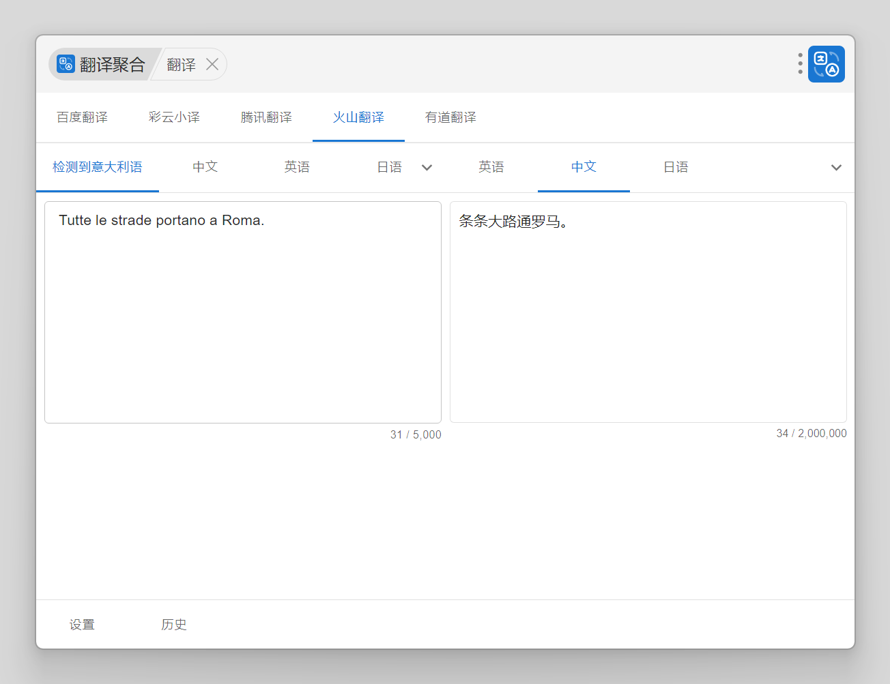
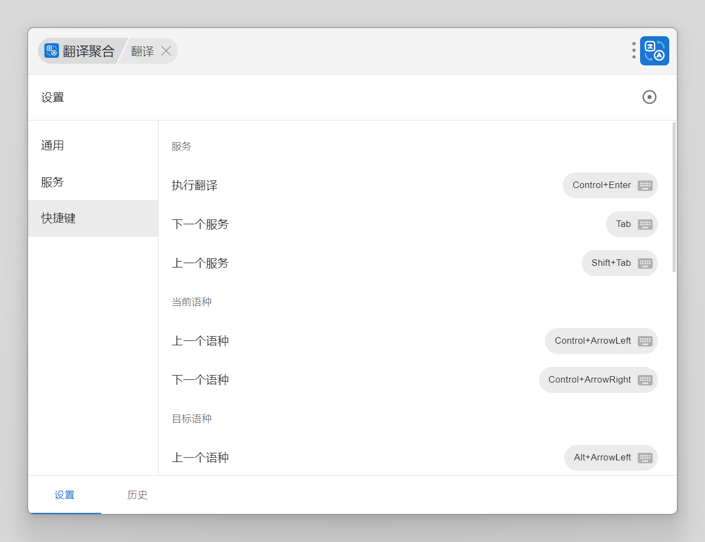

# uTools Translator 聚合翻译

一个基于 uTools 平台的翻译插件，支持多服务聚合翻译，提供类 Google 翻译界面体验。

## 功能特性

- ⚡ 多服务支持：集成多个翻译服务
- 🌍 多语言支持：完整支持语言列表请参考: [支持的语言](#支持的语言)
- 📱 类 Google 翻译界面：保留最近使用的三个语言, 常用语言无需进入二级菜单
- 🎯 智能检测：自动识别源语言, 自动切换目标语言
- 💾 翻译历史：保存历史记录
- ⌨️ 快捷键支持：支持自定义快捷键操作
- 🔄 防抖处理：优化输入体验
- 📊 使用量限制：显示各服务使用配额, 超出配额时限制(实验性功能)

### 支持的服务

- 百度翻译
- 彩云小译
- 腾讯翻译
- 火山翻译
- 有道翻译

### 支持的语言

[支持的语言](https://github.com/yuzhian/utools-translator/blob/main/src/plugins/language/languages.csv)

## 使用说明

### 安装方式

在 uTools 插件市场搜索 "翻译聚合"

### 使用方式

- 关键词触发：输入 `翻译` 或 2-5000 个字符直接翻译
- OCR 文字识别：通过图片文字识别进入翻译模式

### 截图




## 本地开发

```
├─components ---------- 复用组件
├─plugins ------------- 扩展
│  ├─action ----------- 动作, 复制译文等, 供快捷键绑定
│  ├─language --------- 语言支持情况, 以及对应的服务语言编码
│  ├─migration -------- 数据迁移, 版本升级时支持旧数据
│  │  └─versions ------ 迁移版本
│  └─service ---------- 翻译服务实现
├─store --------------- 状态管理
│  ├─general ---------- 通用设置项
│  ├─keybinding ------- 快捷键绑定
│  ├─service ---------- 服务配置
│  ├─language --------- 最近使用的语言
│  └─record ----------- 翻译记录
├─types --------------- 类型定义
├─util ---------------- 工具函数
└─views --------------- 页面
    ├─main ------------ 翻译主体, 输入框和翻译组件, 包括一些翻译处理
    ├─selector -------- 语言选择器
    └─panel ----------- 底部面板, 显示翻译结果
       ├─setting ------ 设置面板
       └─RecordsPanel - 翻译记录面板
```

### 运行服务

```bash
yarn
yarn dev
```

### Icon

- Logo: [Iconsax Duotone Line Icons / Translate](https://www.svgrepo.com/svg/498497/translate)
- Author: [Iconsax](https://www.svgrepo.com/author/Iconsax/)
- Padding: 16%
- BG Radius: 16%
- BG Color: #167ee6
- 其余默认
